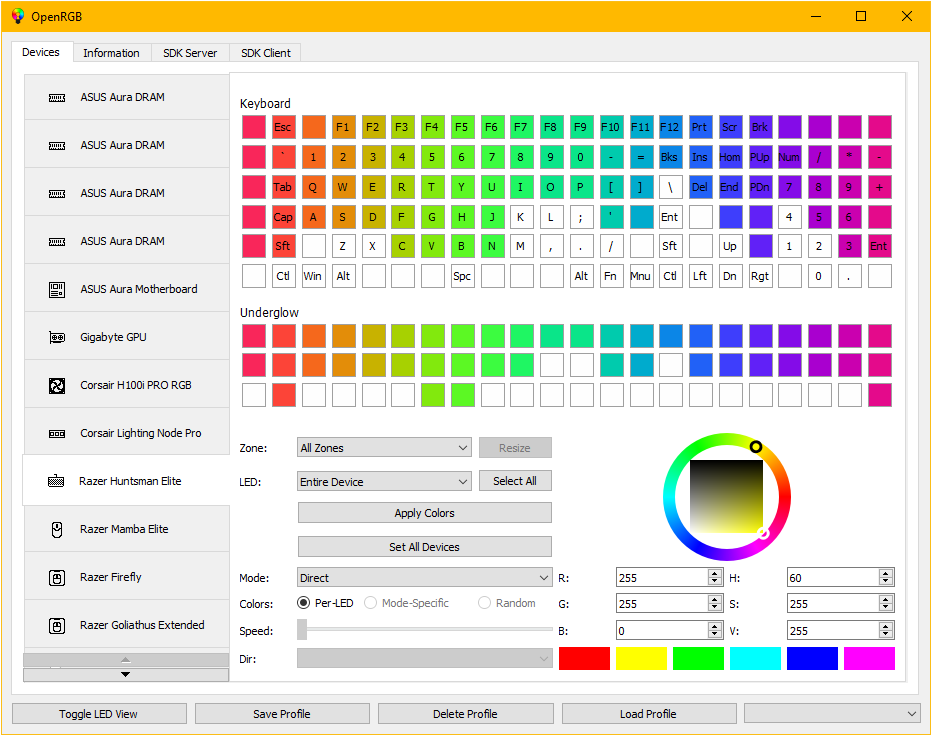

## 

One of the biggest complaints about RGB is the software ecosystem surrounding it.  Every manufacturer has their own app, their own brand, their own style.  If you want to mix and match devices, you end up with a ton of conflicting, functionally identical apps competing for your background resources.  On top of that, these apps are proprietary and Windows-only.  Some even require online accounts.  What if there was a way to control all of your RGB devices from a single app, on Windows, Linux, and MacOS, without any nonsense?  That is what OpenRGB sets out to achieve.  One app to rule them all.

## Features

* Set colors and select effect modes for a wide variety of RGB hardware
* Save and load profiles
* Control lighting from third party software using the OpenRGB SDK
* Command line interface
* Connect multiple instances of OpenRGB to synchronize lighting across multiple PCs
* Can operate standalone or in a client/headless server configuration
* View device information
* No official/manufacturer software required
* Graphical view of device LEDs makes creating custom patterns easy

## Website

* Check out our website at [openrgb.org](https://openrgb.org)

## Supported Devices

* See the [Supported Devices](https://openrgb.org/devices.html) page for the current list of supported devices.

## WARNING!

This project interacts directly with hardware using reverse engineered protocols.  While we do our best to make sure we're sending the right data, there is always some risk in sending data to hardware when we don't understand exactly how that hardware works.  There have been issues in the past with certain hardware getting damaged/bricked and we have either disabled or fixed the offending code.  That said, with OpenRGB always changing and the landscape of RGB devices being of widely varying quality, we can't guarantee it won't happen again.  By installing and using OpenRGB you accept this risk.

## Download OpenRGB

  * Pre-built binaries are available for the following platforms:
    * Windows
    * Linux (AppImage, .deb, and .rpm)
    * MacOS
  * Released versions are available to download on [OpenRGB.org](https://openrgb.org/releases.html) or under [Releases](https://gitlab.com/CalcProgrammer1/OpenRGB/-/releases/permalink/latest).
  * Experimental (aka Pipeline) versions are available to download on [OpenRGB.org](https://openrgb.org/index.html#pl).
  * On Windows, you will need the **Microsoft Visual 2019 C++ runtime** installed.  You can get it [here](https://support.microsoft.com/en-us/help/2977003/the-latest-supported-visual-c-downloads).
  * An unofficial Flatpak release is [available on Flathub](https://flathub.org/apps/details/org.openrgb.OpenRGB)
    * Note: If using the AppImage or Flatpak versions, ensure you [install the latest udev rules](Documentation/UdevRules.md).
  * Released versions are officially packaged for various distributions including Alpine, Fedora, and Arch.
  * Arch users can also install from the AUR for both the [release](https://aur.archlinux.org/packages/openrgb/) and [pipeline](https://aur.archlinux.org/packages/openrgb-git/) versions.

## Compile OpenRGB

  * Instructions for compiling from source are [available here](Documentation/Compiling.md).

## Setup Device Access

  * After installing OpenRGB, please see the [SMBus Access](Documentation/SMBusAccess.md) and [USB Access](Documentation/USBAccess.md) pages for instructions on setting up access to your RGB devices.

## Join Our Discord

* https://discord.gg/AQwjJPY

## Visit Our Lemmy Community

* https://lemmy.ml/c/OpenRGB

## How-Tos and FAQs

* [Windows Setup and Usage](https://gitlab.com/OpenRGBDevelopers/OpenRGB-Wiki/-/blob/stable/OpenRGB-Windows-Setup-and-Usage.md)
* [Frequently Asked Questions](https://gitlab.com/OpenRGBDevelopers/OpenRGB-Wiki/-/blob/stable/Frequently-Asked-Questions.md)

## Support OpenRGB

* OpenRGB is a project I created to solve a problem I had with the RGB ecosystem.  My goal isn't to make money off of this project.  That said, people have requested to donate, and donations allow me to buy more RGB stuff to reverse engineer.
* [Donate via PayPal](https://www.paypal.com/cgi-bin/webscr?cmd=_donations&business=4VPTFMD3G4QVG&item_name=OpenRGB+Development&currency_code=USD&source=url)
* [Become a Patron](https://www.patreon.com/CalcProgrammer1) (I'm not doing any Patreon-exclusive content, it's purely for donation)
* Donate via Bitcoin: 1N83YPu7btXYadPS1neB9zX7X1QTdpyZQ

## History of OpenRGB

* OpenRGB is a continuation of OpenAuraSDK, which itself was created out of reverse engineering work done on the Keyboard Visualizer project.  For a complete history of the RGB projects that led to OpenRGB's creation, see the [History page](https://gitlab.com/OpenRGBDevelopers/OpenRGB-Wiki/-/blob/stable/History-of-OpenRGB.md).

## Contributing

* Want to contribute support for a new device?  Check out the [RGBController API](Documentation/RGBControllerAPI.md) page for documentation of how OpenRGB implements device control.
* Want to create a new OpenRGB SDK client implementation?  Check out the [OpenRGB SDK Documentation](Documentation/OpenRGBSDK.md) page for documentation of how the OpenRGB SDK network protocol functions.
* Please read the [Contributing Guidelines](CONTRIBUTING.md) before starting work on your new changes.

## OpenRGB SDK

* OpenRGB provides a network interface for controlling supported RGB devices from other software.  These projects implement the OpenRGB SDK and provide additional ways for you to control your lighting setup.

  * OpenRGB Python Client (by bahorn): https://github.com/bahorn/OpenRGB-PyClient
  * OpenRGB Python Client (by jath03): https://github.com/jath03/openrgb-python
  * OpenRGB Node.js Client (by vlakreeh): https://github.com/vlakreeh/openrgb
  * D-Bus Connector for OpenRGB (by Vinno97): https://github.com/Vinno97/OpenRGB-DBus-Connector
  * OpenRGB.NET - C# OpenRGB Client (by diogotr7): https://github.com/diogotr7/OpenRGB.NET
  * OpenRGB-Client - Java Client (by morg): https://gitlab.com/mguimard/openrgb-client
  * OpenRGB-SDK - NodeJS client (by Mola19): https://www.npmjs.com/package/openrgb-sdk
  * OpenRGB-cppSDK - C++ client (by Youda008): https://github.com/Youda008/OpenRGB-cppSDK
  * openrgb-rs - Rust client (by nicoulaj): https://github.com/nicoulaj/openrgb-rs

## Applications Supporting OpenRGB SDK

* While OpenRGB itself only provides control over the lighting effects built into hardware, several open source applications can use the OpenRGB SDK to provide synchronized lighting effects for your devices.

  * Keyboard Visualizer (by me): https://gitlab.com/CalcProgrammer1/KeyboardVisualizer
  * OpenRGB E1.31 Receiver (by me): https://gitlab.com/CalcProgrammer1/OpenRGBE131Receiver
  * Project Aurora (support added by diogotr7): https://github.com/Aurora-RGB/Aurora
  * Artemis 2 (support added by diogotr7 as a plugin): https://github.com/Artemis-RGB/Artemis
  * RemoteLight (by Drumber, need OpenRGB plugin): https://github.com/Drumber/RemoteLight
  * OpenRGB-python-FX (by herosilas12): https://github.com/herosilas12/OpenRGB-python-FX
  * AllMyLights (by sparten11740): https://github.com/sparten11740/allmylights
  * OpenRGBRemote (by morg): https://gitlab.com/mguimard/openrgbremote
  * PiLED (by PolisanTheEasyNick): https://github.com/PolisanTheEasyNick/PiLED

## OpenRGB Plugins

* OpenRGB provides a plugin interface for adding features to the OpenRGB application.  The following projects provide additional functionality in the form of plugins.

  * OpenRGB E1.31 Receiver Plugin (by me): https://gitlab.com/OpenRGBDevelopers/OpenRGBE131ReceiverPlugin
  * Effects Engine Plugin (by herosilas12, morg): https://gitlab.com/OpenRGBDevelopers/OpenRGBEffectsPlugin
  * OpenRGB Visual Map Plugin (by morg): https://gitlab.com/OpenRGBDevelopers/OpenRGBVisualMapPlugin
  * Scheduler Plugin (by morg): https://gitlab.com/OpenRGBDevelopers/OpenRGBSchedulerPlugin
  * Skin Plugin (by morg): https://gitlab.com/OpenRGBDevelopers/openrgbskinplugin
  * Hardware Sync Plugin (by morg): https://gitlab.com/OpenRGBDevelopers/OpenRGBHardwareSyncPlugin
  * Http Hook Plugin (by morg): https://gitlab.com/OpenRGBDevelopers/OpenRGBHttpHookPlugin
  * Razer extras Plugin (by morg): https://gitlab.com/OpenRGBDevelopers/OpenRGBRazerExtrasPlugin
  * Fan Hardware Sync Plugin (by Shady): https://gitlab.com/ShadyNawara/openrgbfansyncplugin
  * OpenRGB Ambient Plugin (by krojew): https://github.com/krojew/OpenRGB-Ambient

## Projects Used

  * WinRing0: https://openlibsys.org/
  * libusb: https://github.com/libusb/libusb
  * hidapi: https://github.com/libusb/hidapi
  * libe131: https://github.com/hhromic/libe131
  * NVFC: https://github.com/graphitemaster/NVFC
  * Qt-Plus (ColorWheel): https://github.com/liuyanghejerry/Qt-Plus
  * AMD ADL Libraries: https://github.com/GPUOpen-LibrariesAndSDKs/display-library
  * hueplusplus: https://github.com/enwi/hueplusplus
  * httplib: https://github.com/yhirose/cpp-httplib
  * mdns: https://github.com/mjansson/mdns
  * macUSPCIO: https://github.com/ShadyNawara/macUSPCIO

## Projects Researched

While no code from these projects directly made its way into OpenRGB, these projects have been invaluable resources for protocol information.

  * OpenRazer: https://github.com/openrazer/openrazer
  * OpenRazer-Win32: https://github.com/CalcProgrammer1/openrazer-win32
  * ckb-next: https://github.com/ckb-next/ckb-next
  * linux_thermaltake_riing: https://github.com/chestm007/linux_thermaltake_riing
  * Aura Addressable Header Controller: https://gitlab.com/cneil02/aura-addressable-header-controller
  * OpenPyAURA: https://gitlab.com/thelastguardian/openpyaura
  * AsrLed: https://github.com/EUA/AsrLed
  * asrock-leds: https://github.com/RattyDAVE/asrock-leds
  * hue-plus: https://github.com/kusti8/hue-plus
  * rogauracore: https://github.com/wroberts/rogauracore
  * msi-rgb: https://github.com/nagisa/msi-rgb
  * OpenCorsairLink: https://github.com/audiohacked/OpenCorsairLink
  * msi-keyboard: https://github.com/bparker06/msi-keyboard
  * rivalcfg: https://github.com/flozz/rivalcfg
  * VRMTool: https://github.com/rbrune/VRMtool
  * g810-led: https://github.com/MatMoul/g810-led
  * liquidctl: https://github.com/jonasmalacofilho/liquidctl
  * Annemone: https://github.com/manualmanul/Annemone
  * libcmmk: https://github.com/chmod222/libcmmk
  * Signal RGB Plugins: https://gitlab.com/signalrgb/signal-plugins/-/tree/master/Plugins
  * k550-macos https://github.com/vookimedlo/ck550-macos/tree/master
  * luxafor-python https://github.com/vmitchell85/luxafor-python
  * dreamcheekyusb https://github.com/gbrayut/dreamcheekyusb
  
